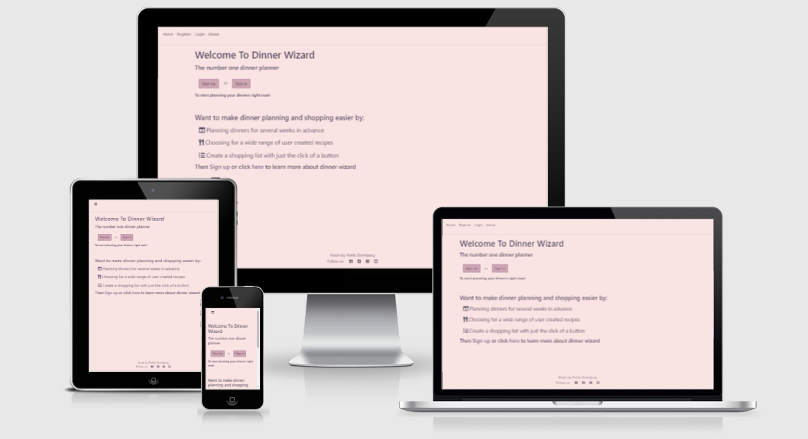
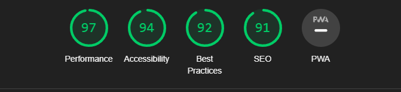

# Dinner Wizard
Dinner Wizard is a web aplpication for planning your dinners over a period of time, and then quickly making a shopping list from the recipes that you want to make. By creating and saving your own favourite recipies for later use, or borwsing recipes created by other users, you will be able to quickly plan a couble of dinners, then by a simple click on a button you will have a complete shopping lsit of all the items included as ingredients for your recipes. <br>
Link to the deployed site: https://dinner-wizard.herokuapp.com/ <br>




### Table of Contents
**[1. User Experience](#1-user-experience)**<br>
**[2. Features](#2-features)**<br>
**[3. Data Model](#3-data-model)**<br>
**[4. Technologies Used](#4-technologies-used)**<br>
**[5. Testing](#5-testing)**<br>
**[6. Deployment](#6-deployment)**<br>
**[7. Credits](#7-credits)**<br>


## 1. User Experience

### 1.1 Project introduction

The goal of this app is to make planning dinners as easy, quick and simple as possible. The average family usually have 10-20 different recipes that cicle, and wouldn't it then be nice to have them saved in a way that a few simple clicks will generate the dinners for a week, and then automatically transform into a shopping list? After all, dinner planning and grocery shopping can be quite the task, espacially for parents with smaller kids. That's is where Dinner Wizard can really help you speed things up in every day life.
### 1.2 Design guidelines

The aim when designing the app is to give it a clean design, where the different fucntions of the app will be in focus. In order for as many users as possible to be able to use the app, it is important that all functions, buttons and lists are placed in an intuitve way, and that creating and editing items will be done in a logical way even to users with less computer experience. Here lies the biggest challange when designing the app.<br>

Click [here](static/media/DinnerWizard.pdf) to view the wireframe showing a draft of the page layout

### 1.3 Project goals

- Provide a way for users to save their favourite and most used recipes

- Provide a way for users to plan what to eat during a week or short period of time

- Help users with dinner inspiration by being able to find new recipes from other users

- Provide a way to quickly create a shopping list to ease grocery shopping

### 1.4 Target audience

The main audience for this application are people who have a few recipes that they use often and want a way to add them to a dinner plan, as well as users who struggle to find inspiration and recipes for their dinners and need a quick way to find recipes. Many people also find it tedius to create a list of groceries before going shopping. We therefore have 3 main type of users

- User who want a way to save recipes to be able to quickly chose from their most used recipes in the future: <br>
**Needs:** A way to save recipes for quick access in the future<br>
**Goal:** Provide every tool necessary for a user to create a recipe and save it to a database<br>
**How:** Create a database model that will hold necessary information about recipes and allow users to choose categories to quickly find them later on, and the ability to mark recipes as "favourite"

- User who wants to find recipes to add new dinner experiences:<br>
**Needs:** A way to search for recipes by name of category<br>
**Goal:** Implement a filter system that works with both name search and categories<br>
**How:** Adding fields in the database model for categories to recipes and provide a search bar to enter recipe names and search

- User who wants to quickly and automatically create a shopping list from the selected recipes:<br>
**Needs:** A way to create a shopping list from the selected recipes without writing things down
**Goal:** To have a simple button click send every item of ingredient from the selected recipes to a shoppinglist
**How:** Create a database model for holding shopping lists and a template connected to a view where all the items are shown and are interactable

### 1.5 User stories

- As an owner, I want to make sure I can remove items where mistakes were mage
- As an owner, I want to be able to handle user information to help users who have lost their information
- As a user, I want to be able to create an account to save my information
- As a user, I want to be able to save my recipes
- As a user, I want to be able to create a dinner plan for a period of time
- As a user, I want to be able to add new types of ingredients to my recipes
- As a user, I want to be able to mark recipes as my favourites for quick and easy access in the future
- As a user, I want to be able to add categories to my recipes to quickly show what type of food they are
- As a user, I want to be able to search for new recipes using categories or name
- As a user, I want to be able to quickly create a shopping list from the recipes I have selected
- As a user, I want to be able to edit the recipes I have created
- As a user, I want to be able to modify and save other peoples recipes
- As a user, I want to be albe to edit the dinner plans I have created
- As a user, I want to be able to create dinner plans for the future, to be inactive until it is time
- As a user, I want to be able to reuse previously active dinner plans

## 2. Features
This application has a full CRUD functionality for creating a recipe plan, recipes and ingredients. All these can be user created in order to provide a wide functionality. For a more in-depth guide to the different features on Dinner Wizard, please check out the [about page](https://dinner-wizard.herokuapp.com/about/) for the site.

### 2.1 Future Features
- The ability to view a preview of a recipe from the recipe list (when adding a recipe to a plan) would be very helpful to get a better idea about a recipe before adding it. THis is beyond the scope of this release, as it would require significant rewriting of the add recipe form
- The ability to edit user information (a profile page) would imrpove user experience and should be a priority for the next release.
- The ability for a user to retrieve a lost password is a very usefull feature, but is beyond the scope of this release as it would require more robust use of allauth or Oauth.

## 3. Data Model
The database model used for this project was based on a Heroku postgres database. This is the schema for the database: <br>
<br>

## 4. Technologies used
- [Django 4](https://docs.djangoproject.com/en/4.0/) A full stack toolkit for python to design dynamic web apps with back end support
- [Jinja 2](https://jinja2docs.readthedocs.io/en/stable/) A templating language to use python variables, conditionals and functions in a html template
- [Bootstrap 4](https://getbootstrap.com/docs/4.0/getting-started/introduction/) A framework for styling web pages using less CSS
- [Crispy forms](https://django-crispy-forms.readthedocs.io/en/latest/) Used to quiclky and easily style html forms,with bootstrap support
- [Python 3.8](https://www.python.org/downloads/release/python-380/) One of the most popular object oriented programming languages
- [JavaScript ES6](https://www.w3schools.com/js/js_es6.asp) A version of JavaScripts that supports advanced JS
- [HTML 5](https://sv.wikipedia.org/wiki/HTML5) The latest stable vesrion of HTML, to render the page in a browser
- [CSS 3](https://sv.wikipedia.org/wiki/Cascading_Style_Sheets) Cascading Style Sheets is used t ostyle html and make your site look prettier
- [Am I Responsive](http://ami.responsivedesign.is/) An app to help you check the responsiveness for your site
- [Webaim contrast checker](https://webaim.org/resources/contrastchecker/) Used to check color contrast to make sure your site is readable enough
- Lighthouse is a tool in chrom dev tools for checking performance, accessibility, best practices and SEO


## 5. Testing
The forms and models used in this project were tested using the python TestCase module. These files have a 100% test coverage. In order to run tests, you must comment out the database information in the settings.py, and instead uncomment the database information that is provided by default. This is due to limitations to the free edition of Heroku postgres database. The views were not tested to full extent, this due to django-allauth making testing user driven content in views very complicated. The entire project was tested in minute detail manually by me (the creator of the site) and some very appreciated help from friends.
### 5.1 Validator testing
- All pages of the site were tested using this [validator](https://validator.w3.org/). All pages passe without warning or errors.
- The css file style.css was tested using this [validator](https://jigsaw.w3.org/). It passes with no errors and no warnings.
- The JavaScript file of the project was tested using [JSHint](https://jshint.com/) and returned no warnings or errors.
- All .py files edited by the user with the exception of the "settings.py" (this file will fail pep8 due to the nature of some of the data. It also has a commented out database, for switching between testing and deoplyed database) and no errors were found.
- The site was run through lighthouse, and score 96 in performance, 95 accessibility, 92 best practices and 91 SEO<br>


### 5.2 Bugs
- As of this moment, there are no longer any known bugs.
- *SOLVED* Upon deploying the site and allowing other users to test it, an issue creating accounts using email was found. Whenever a user entered the optional email field, they would recieve a "500 server not found" error. This was likely linked to allauth wanting email verification, so turning this off in settings ```ACCOUNT_EMAIL_VERIFICATION = 'none'``` solved this issue fixing the bug and allowing users to sign up with or without email.
### 5.3 Testing user Stories
- As an owner, I want to make sure I can remove items where mistakes were made
    - The admin panel provides full crud functionality to every item in the database.
- As an owner, I want to be able to handle user information to help users who have lost their information
    - "Forget password fucntionality will be added in a later release.
- As a user, I want to be able to create an account to save my information
    - The site has django allauth authorization and sign up fucntionality.
- As a user, I want to be able to save my recipes
    - The create recipe page can be accessed from three different places on the site, providing all a user needs to save a recipe.
- As a user, I want to be able to create a dinner plan for a period of time
    - Upon login, the user is directed to the plans page, where the button to create a plan is right at the center.
- As a user, I want to be able to add new types of ingredients to my recipes
    - The two fields for name and unit under the Ingredient list lets the user add a recipe that is not in the template list.
- As a user, I want to be able to mark recipes as my favourites for quick and easy access in the future
    - This fucntionality is accessable from the plans page, where a recipe in the recipe list can be marked as favourite.
- As a user, I want to be able to add categories to my recipes to quickly show what type of food they are
    - A long list of categories are available for categorization. More categories can be added if need arises.
- As a user, I want to be able to search for new recipes using categories or name
    - There is a filter on the recipe lists page, allowing a user to filter by name, category, favourites and teh user's own recipes.
- As a user, I want to be able to quickly create a shopping list from the recipes I have selected
    - From the plans page, the button "Create Shopping List" will allow a user to with just one name create a shopping list containing all teh ingredients from the plan's recipes.
- As a user, I want to be able to edit the recipes I have created
    - On the plans page (which is like the user's start page) the user has access to all recipes created by the user.
- As a user, I want to be able to modify and save other peoples recipes
    - This feature will be added in a later release.
- As a user, I want to be able to edit the dinner plans I have created
    - The user can fully edit any active plan. PLans that are set as upcoming or previous can be made active, and then editet if need be.
- As a user, I want to be able to create dinner plans for the future, to be inactive until it is time
    - There are 3 modes on the status of a recipe: Upcoming, Active and Previous.
- As a user, I want to be able to reuse previously active dinner plans
    - Any plan no longer active can be accessed from the "Previous" plans list.
### 5.4 Contrast check
- All colors were checked using the Webaim contrast checker. The background used for lists and the main text scored the lowest, with a 7.51 rating, which is still above the accepted values by some margin.
- This are some link icons that score lover, however as they are icons they are visable enough as it is.
## 6. Deployment


### 6.1 Make a clone
To clone the repository to make a local copy of it, follow these steps:
1. Login to [GitHub](https://github.com/) and locate the [repository](https://github.com/oljung/portfolio-project-two)
1. Under the repository name, click "Clone or download"
1. To clone the repository using HTTPS copy the link under "clone with HTTPS"
1. Open Git Bash
1. Change directory to where you want the clone to be saved
1. Use the command "git clone" and then paste the url you copied from step 3
```
$ git clone https://github.com/oljung/portfolio-project-two
```
7. Your clone will now be saved, and any commits will be saved to your new repository

### 6.2 Deploy on Heroku


## 7. Credits
Here are some people and resources that deserve some extra mentions.

### Code
- All code was written by the sole contributor of the project (me). 
- For help solving issues with django, the [django documentation](https://docs.djangoproject.com/en/4.0/) was used
- For information about bootstrap classes, [bootstrap documentation was used](https://getbootstrap.com/docs/4.0/getting-started/introduction/)
- Some issues were solved using heroku documentation, as well as tutor support for solving an issue relating to collect static files

### Testing
- Automated testing was done using TestCase, and here the django documentation provided helpful examples
- For manual testing, much of the work was done by myself during development. Upon deployment, my old hackathon team member Andrew, Helena, Katherine and Yorick helped alot.

### Special Mentions
I would also like to give a special mention to my mentor Nishant Kumar, who really helped inspire and motivate me with his praise and excellent recommendations. Thank you!